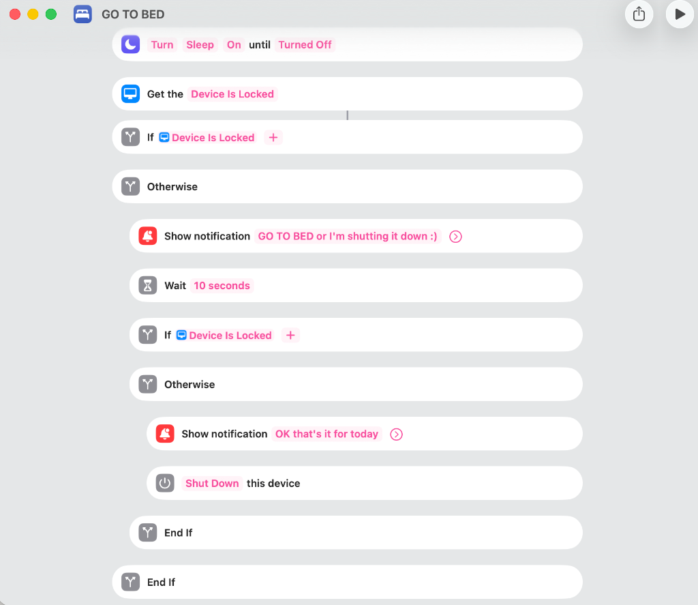
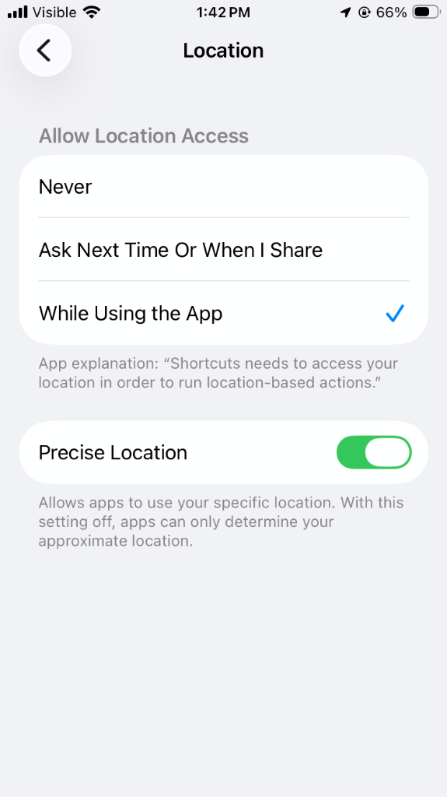
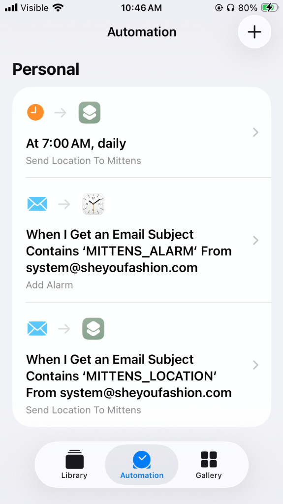
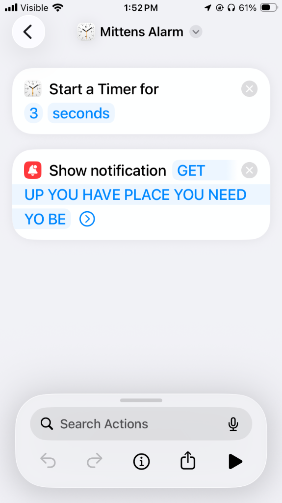
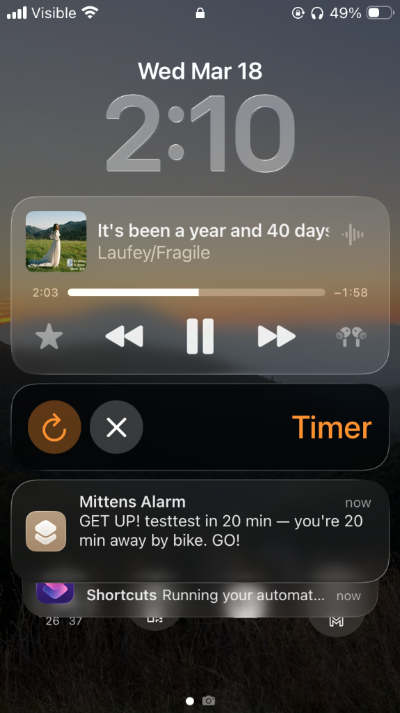
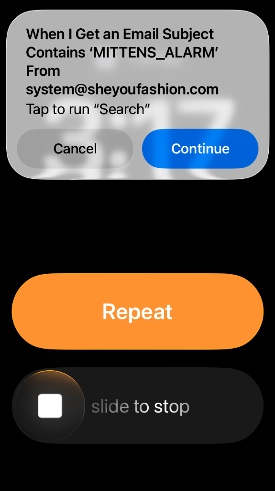
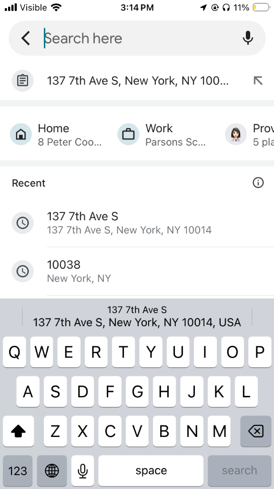

# Mittens 🧤

(full app will be released soon, mittens as a completely personalized, proactive health AI that actually remembers and care about your habits and to make you better, below are simple no download apple shortcut version)
**Susanna's fully personalized AI assistant** — built to keep her on track, on time, nutrition-balanced and well-rested.

Mittens runs 24/7 on a server, watches Susanna's calendar, tracks her location, calculates when she needs to leave, and — when it's bedtime — literally shuts down her devices. It also auto-schedules her daily health rhythm (meals, sunrise, bedtime) into her Google Calendar, all tuned to the natural light cycle.

Runs on Railway (free). Uses Resend email (free). No monthly costs.

## What Mittens Does

### 🗓️ Never Miss an Appointment
Monitors all of Susanna's Google calendars and calculates biking time from her current GPS location. When it's time to leave, Mittens fires an alarm on her iPhone — escalating from notification → alarm → alarm again if she doesn't move.

### 🌅 Sunrise-Based Health Rhythm
Every day, Mittens fetches the sunrise time and auto-creates a full health schedule in the **Health** calendar:

| Event | Timing | Purpose |
|-------|--------|---------|
| 🍳 Breakfast | Sunrise | Start of 12h eating window |
| 🥗 Lunch | Sunrise + 5h 50min | Midpoint of eating window |
| 🍽️ Dinner | Sunrise + 11h 40min | Eating window closes |
| 😴 Bedtime | (next sunrise − 9h) − 30min | Wind down (lights out 30 min later) |

Schedules 3 days ahead. Shifts naturally with seasons — earlier meals in summer, later in winter.

### 🛏️ Bedtime Enforcement
When it's time to sleep, Mittens doesn't just remind — it **forces compliance**:

1. **Away from home?** Fires a `MITTENS_ALARM` accounting for travel time + 30 min to get ready
2. **30 min before bed:** Sends `MITTENS_DOWNTIME` email → triggers iPhone automation
3. **iPhone automation:** Warns "GO TO BED or I'm shutting it down :)" → 10 seconds → **shuts down the device**

```
9:45 PM bedtime, 30 min from home:

  8:15 PM → MITTENS_ALARM "Head home for bed!"
  9:15 PM → MITTENS_DOWNTIME → activates Sleep Focus
          → 10 sec warning → device shuts down 💀
  9:45 PM → Lights out 😴
```

Bedtime = tomorrow's sunrise − `SLEEP_HOURS`. No fixed schedule — it shifts with the sun.



## How It Works

```
Railway Server (runs 24/7)              Susanna's iPhone
┌──────────────────────────┐            ┌────────────────────────┐
│  mittens.py               │            │                        │
│  ┌─ Calendar sync        │            │  Mail Automations:     │
│  │  sunrise fetch +      │            │                        │
│  │  Google webhooks      │  Email:    │  MITTENS_ALARM         │
│  ├─ Smart scheduler      │  triggers  │  → Timer + Alert       │
│  │  adaptive intervals   │──────────►│  → Open Google Maps    │
│  ├─ Travel calculator    │  (iCloud)  │                        │
│  │  biking time to venue │            │  MITTENS_DOWNTIME      │
│  ├─ Health scheduler     │            │  → Sleep Focus ON      │
│  │  meals + bedtime      │            │  → Shut Down device    │
│  ├─ Sunrise API          │            │                        │
│  │  seasonal rhythms     │  GPS POST  │  7 AM daily:           │
│  └─ Alert escalation     │◄──────────│  → Send location       │
│                          │            │                        │
│  Google Calendar ────────│──webhook──│                        │
│  (push notifications)    │            │                        │
└──────────────────────────┘            └────────────────────────┘
     Resend (free)                           Shortcuts app
```

> **Note**: Emails must go to an **iCloud** address — Apple Mail only does instant push for iCloud. Gmail uses fetch (15-30 min delay).

## Calendar Sync Architecture

Mittens uses an **event-driven** approach — no constant polling:

1. **Sunrise fetch** — At sunrise each morning, pull the full day's events from all calendars
2. **Google webhooks** — When you add/edit/delete an event, Google sends a push notification → Mittens re-fetches instantly
3. **Adaptive monitor** — The check loop sleeps between events and ramps up as appointments approach:

| Situation | Check interval |
|-----------|---------------|
| No events / event > 2h away | 10 min |
| Physical event 1–2h away | 5 min |
| Physical event 30–60 min | 2 min |
| Physical event 15–30 min | 1 min |
| Physical event < 15 min | 30s (escalation) |
| Virtual event > 8 min | Sleep until 8 min before |
| Virtual event < 8 min | 30s (sends Zoom reminder) |
| Webhook fires | **Instant** wake |

Travel time is always calculated from **live GPS**, not pre-computed.

### 🧹 Inbox Cleanup
Since the iCloud inbox is only used for Mittens automation emails, old emails (before today) are automatically deleted once per day via IMAP.

## Setup

### Step 1: Google Calendar API

1. Go to [Google Cloud Console](https://console.cloud.google.com/)
2. Create a project → Enable **Google Calendar API**
3. **Credentials** → Create **OAuth 2.0 Client ID** (Desktop app)
4. Download JSON → save as `credentials.json`
5. **Important**: Set the OAuth consent screen to **"In Production"** so tokens don't expire every 7 days

### Step 2: Get Google Token

```bash
pip install google-auth-oauthlib google-api-python-client
python auth_helper.py
```

Browser opens → log in → copy the token JSON. The scope includes read + write (for creating health events).

### Step 3: Deploy to Railway

1. Push to GitHub, deploy from [railway.app](https://railway.app)
2. Add these **environment variables**:

| Variable | Value |
|----------|-------|
| `MITTENS_API_KEY` | `python -c "import secrets; print(secrets.token_urlsafe(32))"` |
| `GOOGLE_TOKEN_JSON` | Token JSON from Step 2 |
| `GOOGLE_CREDENTIALS_JSON` | Contents of `credentials.json` |
| `RESEND_API_KEY` | Your [Resend](https://resend.com) API key |
| `FROM_EMAIL` | Sender email (must be verified in Resend) |
| `TO_EMAIL` | Your **iCloud** email (instant push in Mail app) |
| `HOME_LAT` | Your home latitude |
| `HOME_LON` | Your home longitude |
| `TRAVEL_MODE` | `bicycling` (or `driving`, `walking`, `transit`) |
| `BUFFER_MINUTES` | `5` |
| `CALENDAR_IDS` | `all` (auto-discovers all calendars) |
| `SLEEP_HOURS` | `9` (bedtime = sunrise - 9h, `0` to disable) |
| `TZ` | `America/New_York` |
| `TIMEZONE` | `America/New_York` |
| `HEALTH_CALENDAR` | `Health` (name of calendar for meals/sleep events) |
| `WEBHOOK_BASE_URL` | Your Railway public URL (e.g. `https://web-production-xxxx.up.railway.app`) |
| `CLEANUP_EMAILS` | `true` to auto-delete old emails daily (requires `ICLOUD_APP_PASSWORD`) |
| `ICLOUD_APP_PASSWORD` | App-specific password from [appleid.apple.com](https://appleid.apple.com) → Sign-In and Security |

> See [SECURITY.md](SECURITY.md) for security guidance.
> See [SETUP_NOTES.md](SETUP_NOTES.md) for gotchas and troubleshooting.

### Step 4: iPhone Automations

Open **Mail** app and add your **iCloud** account (iCloud gets instant push; Gmail does not).

**Settings → Privacy & Security → Location Services → Shortcuts**: set to "While Using the App" + **Precise Location** on.



#### Shortcut: "Mittens Location"
1. **Get Current Location**
2. **Dictionary** — `lat`: Latitude, `lon`: Longitude
3. **Get Contents of URL** — POST to `https://YOUR-APP.up.railway.app/location?key=YOUR_KEY` with JSON body

#### Automation 1: Morning GPS (7 AM)
- **Trigger**: Time of Day → 7:00 AM
- **Action**: Run Shortcut → "Mittens Location"
- Run Immediately ✓

#### Automation 2: Location Request
- **Trigger**: Email → Subject Contains `MITTENS_LOCATION`
- **Action**: Run Shortcut → "Mittens Location"
- Run Immediately ✓

#### Automation 3: Alarm Trigger
- **Trigger**: Email → Subject Contains `MITTENS_ALARM`
- **Actions**:
  1. Start Timer (3 seconds)
  2. Show Notification (Content from email)
  3. Copy Content to clipboard
  4. Search in Google Maps (Open When Run ✓)
- Run Immediately ✓

#### Automation 4: Bedtime Shutdown
- **Trigger**: Email → Subject Contains `MITTENS_DOWNTIME`
- **Actions**:
  1. Turn Sleep Focus **On**
  2. Get Device Is Locked
  3. If Device Is Locked → do nothing (already in bed)
  4. Otherwise:
     - Show Notification: "GO TO BED or I'm shutting it down :)"
     - Wait 10 seconds
     - If Device Is Locked → great
     - Otherwise → Show Notification: "OK that's it for today" → **Shut Down** device
- Run Immediately ✓


 

#### What it looks like when it fires:

  

## Calendar Events

Add a **location** to your events. Mittens only monitors events with addresses:

- "Physical Therapy" at "123 Main St" → ✅ Monitored
- "CS 101" at "Warren Weaver Hall, NYU" → ✅ Monitored
- "Team Standup" with Zoom link → ✅ Zoom reminder (5 min before)
- "Call with Mom" (no location) → Ignored

## API Endpoints

| Endpoint | Method | Auth | Purpose |
|----------|--------|------|---------|
| `/` | GET | No | Health check |
| `/location` | POST | Key | Receive GPS `{"lat": x, "lon": y}` |
| `/location` | GET | Key | Debug: see current location |
| `/check` | POST | Key | Check if alarm is needed now |
| `/test` | POST | Key | Send test email |
| `/stats` | GET | Key | View attendance stats |
| `/calendar/webhook` | POST | No | Google Calendar push notifications |

All authenticated endpoints require `?key=YOUR_API_KEY`.

## Files

```
mittens.py          → Flask server, routes, config, startup
monitor.py          → MittensMonitor: background loop, adaptive scheduler
event_checker.py    → Event checking, virtual meetings, alarm escalation
health.py           → Sunrise API, meal scheduling, bedtime enforcement
housekeeping.py     → Email cleanup, webhook renewal, GPS requests
calendar_client.py  → Google Calendar API (sunrise fetch + webhook sync)
travel.py           → Travel time (bicycling/driving/walking/transit)
alerts.py           → Email alerts via Resend
memory.py           → SQLite attendance tracking
auth_helper.py      → One-time Google OAuth (run locally)
```

## Costs

| Service | Cost |
|---------|------|
| Railway | Free (500 hrs/mo) |
| Resend | Free (100 emails/day) |
| Google Calendar API | Free |
| Sunrise API | Free (no key needed) |
| Google Maps API | Free tier or skip (uses estimates) |
| iCloud IMAP | Free |
| **Total** | **$0/month** |

---

> **GitHub Topics**: `personal-assistant` `ios-automation` `google-calendar` `health` `productivity` `iphone-shortcuts` `python`
